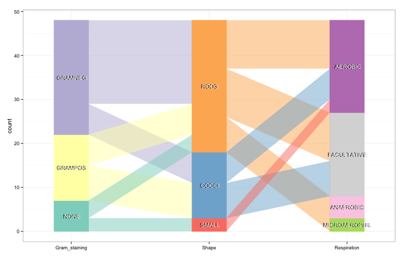

# Parallel coordinates plot for clinically relevant bacteria

## Background
Here, I use R ggplot / ggparallel to plot characteristics of clinically relevant bacteria.

## Output

## To do

* Fix font colors

## References

The ggparallel package is available here: https://github.com/heike/ggparallel

